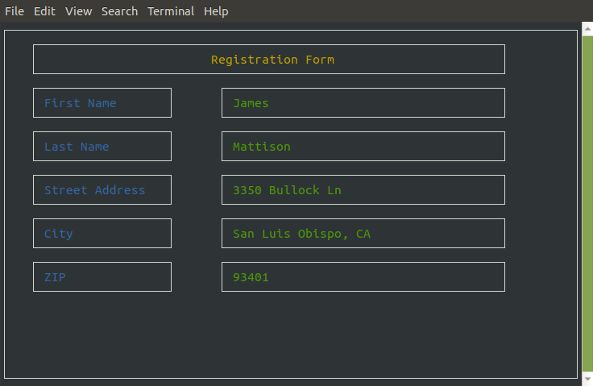
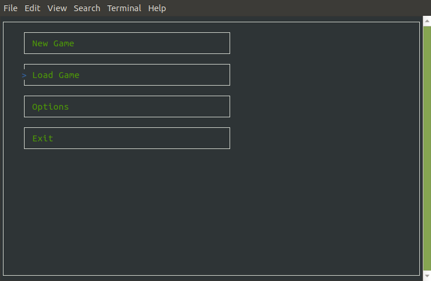
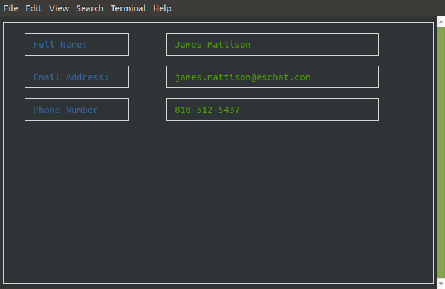
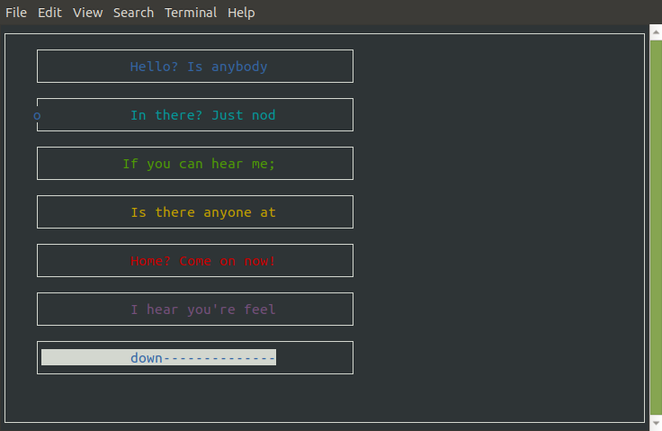

### framedwindow library

> __Library to build simple menus, forms, and text-user-interfaces with Python 3.__
> _A no-dependency way to provide simple dynamic Forms, Menus, and pretty-looking 
>input and output on a standard terminal, without having to manage the geometry or 
>archaic syntax of ncurses._
>


### Quickstart
Here are three simple examples of the three main input classes, ```Form``` and ``` Menu```, and ``` FormTemplate```
#### Form:
``` python
import windowlib

window = windowlib.DefaultWindow()

form = windowlib.Form()

answers = form.run_form(
    "First Name",
    "Last Name", 
    "Street Address",
    "City",
    "ZIP",
    title="Registration Form"
    )

with open("answers.txt", "w") as formout:
    for reply in answers:
            formout.write(reply + "\n")
```



#### Menu:
```Menu``` uses the ```run_menu``` method, which returns an integer representing the position 
of the cursor when the user presses the enter key, indexed from the top. Int the picture below, the return would be 1.
``` python
import windowlib

win = windowlib.DefaultWindow()

choices = [
        "New Game", 
        "Load Game",
        "Options",
        "Exit"
]

menu = windowlib.Menu()

for choice in choices:
    menu.register_button(choice, width=60, style="boldgreen")

menu.run_menu()
```


#### A Simple TemplatedForm:
_TemplatedForm requires a global-level key called either __"labels"__ or __"questions"__ in its input JSON file._
``` python
import windowlib
# assuming you have foo.json, containing:
# {
#	"questions": [
#		"Full Name:",
#		"Email Address:",
#		"Phone Number"
#	]
#}

window = windowlib.DefaultWindow()

form = windowlib.FormTemplate("foo.json")

answers = form.run_form()

# and a simple way to redump it -
import json
with open("foo.json", "a") as jsout:
    form_return = { "answers": answers }
    json.dump(form_return, jsout, indent=4)
    

```

__Produces:__
``` json
{
	"questions": [
		"Full Name:",
		"Email Address:",
		"Phone Number"
	]
},
{
    "answers": [
        "James Mattison",
        "james.mattison@eschat.com",
        "818-512-5437"
    ]
}
```




##### Another ```Menu``` example, highlighting the ```style=``` property:
``` python
import windowlib


win = windowlib.DefaultWindow()

pretty = windowlib.Menu()

binputs = [ 
        ( "Hello? Is anybody", "blue" ),
        ( "In there? Just nod", "cyan" ),
        ( "If you can hear me;", "green"),
        ( "Is there anyone at", "yellow" ),
        ( "Home? Come on now!", "red" ), 
        ( "I hear you're feel", "magenta" ),
        ( "Ing down-----------", "bluewhite" )
]

for mopt in binputs:
    pretty.register_button(mopt[0], width=40, style=mopt[1], centered=True)

pretty.run_menu(pt="o")

```


